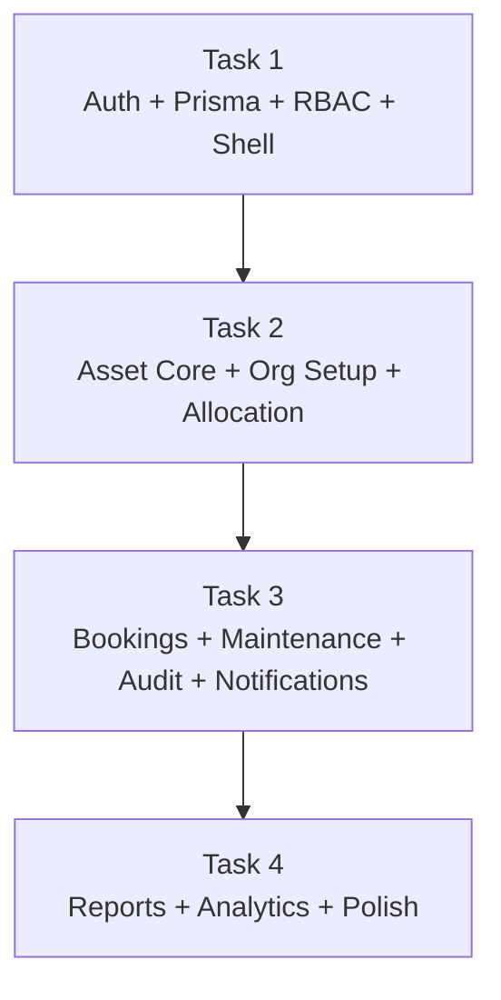

# AssetFlow ERP — Implementation Plan

**Stack:** Next.js 16 · React 19 · TypeScript · Tailwind v4 · Neon (PostgreSQL) · Prisma · Better Auth · Zod · Zustand · TanStack Table · Sonner

---

## Overview

AssetFlow is an Enterprise Asset & Resource Management System. This plan divides the entire build into **4 ordered task groups**, starting with the most complex foundational work and ending with reporting/analytics. Each group must be completed in order since later groups depend on earlier ones.

---

> [!CAUTION]
> **Next.js v16 Note:** This project uses Next.js 16 which has breaking changes from common training data. Before writing any route handler, middleware, or layout code, always read the relevant guide in `node_modules/next/dist/docs/`.

---

## Task 1 — Foundation: Auth, Prisma, RBAC & Core Infrastructure

> [!IMPORTANT]
> This is the highest-complexity task and is a hard prerequisite for everything else. No other task should begin until Task 1 is complete and verified.

### 1.1 — Project Setup & Dependencies

~~Install all required packages in one pass~~ ✅ **Done**

```bash
# Already completed
bun add better-auth @prisma/client zod zustand @tanstack/react-table sonner
bun add -d prisma
```

**New/Modified Files:**
- `package.json` — add all dependencies
- `next.config.ts` — verify/update config for server components, image domains
- `app/globals.css` — design system tokens (color palette, typography scale, spacing)

---

### 1.2 — Prisma Schema & Neon DB Setup

Define the **full** database schema upfront. All models must be defined here to avoid painful migrations later.

#### [NEW] `prisma/schema.prisma`

**Models to define:**

| Model | Key Fields |
|---|---|
| `User` | id, name, email, emailVerified, image, role (EMPLOYEE \| ASSET_MANAGER \| DEPARTMENT_HEAD \| ADMIN), status, departmentId, createdAt |
| `Session` | Better Auth session fields |
| `Account` | Better Auth OAuth account fields |
| `Verification` | Better Auth email verification |
| `Department` | id, name, code, status (ACTIVE \| INACTIVE), parentDepartmentId (self-relation), headId (→ User) |
| `AssetCategory` | id, name, description, customFields (Json) |
| `Asset` | id, assetTag (AF-XXXX auto), name, categoryId, serialNumber, acquisitionDate, acquisitionCost, condition, location, status (AVAILABLE \| ALLOCATED \| RESERVED \| UNDER_MAINTENANCE \| LOST \| RETIRED \| DISPOSED), isBookable, photoUrl, documents (Json) |
| `Allocation` | id, assetId, userId, departmentId, allocatedAt, expectedReturnDate, returnedAt, conditionNotes, status (ACTIVE \| RETURNED \| OVERDUE) |
| `TransferRequest` | id, assetId, fromUserId, toUserId, requestedById, status (PENDING \| APPROVED \| REJECTED), approvedById, notes |
| `Booking` | id, assetId (bookable resource), userId, title, startTime, endTime, status (UPCOMING \| ONGOING \| COMPLETED \| CANCELLED) |
| `MaintenanceRequest` | id, assetId, raisedById, issue, priority (LOW \| MEDIUM \| HIGH \| CRITICAL), photoUrl, status (PENDING \| APPROVED \| REJECTED \| IN_PROGRESS \| RESOLVED), technicianId, approvedById, resolvedAt |
| `AuditCycle` | id, name, scope (DEPARTMENT \| LOCATION), scopeId, startDate, endDate, status (ACTIVE \| CLOSED), createdById |
| `AuditAssignment` | id, cycleId, auditorId |
| `AuditEntry` | id, cycleId, assetId, auditorId, result (VERIFIED \| MISSING \| DAMAGED), notes |
| `Notification` | id, userId, type, title, message, read, entityType, entityId, createdAt |
| `ActivityLog` | id, userId, action, entityType, entityId, metadata (Json), createdAt |

> [!NOTE]
> Better Auth requires `User`, `Session`, `Account`, and `Verification` tables to follow its exact schema. Use the Better Auth Prisma adapter docs to generate/copy these accurately.

#### [NEW] `.env.example` ✅ **Done** — [.env.example](file:///d:/PROJECTS/assetflow/.env.example)
Template created. Copy to `.env.local` and fill in your real Neon connection string and Better Auth secret.

#### Prisma Commands:
```bash
npx prisma generate
npx prisma db push   # for dev/POC; use migrate for prod
```

---

### 1.3 — Better Auth Setup

#### [NEW] `lib/auth.ts`
- Initialize Better Auth with Prisma adapter + Neon DB
- Configure session strategy (JWT or DB sessions)
- Enable email/password provider
- **No role self-selection at signup** — signup always creates `EMPLOYEE` role
- Set up `sendVerificationEmail` (can use console.log for POC)

#### [NEW] `lib/auth-client.ts`
- Export Better Auth client for use in React components/hooks

#### [NEW] `app/api/auth/[...all]/route.ts`
- Next.js catch-all route handler for Better Auth

#### [NEW] `middleware.ts`
- Protect routes based on session presence
- Role-based route guards (Admin-only paths, etc.)

---

### 1.4 — RBAC Utilities

#### [NEW] `lib/rbac.ts`
```ts
// Role hierarchy and permission matrix
export const ROLES = ['EMPLOYEE', 'DEPARTMENT_HEAD', 'ASSET_MANAGER', 'ADMIN'] as const
export type Role = typeof ROLES[number]

export const permissions = {
  // Define per-action permission checks
  canAllocateAsset: (role: Role) => ['ASSET_MANAGER', 'ADMIN'].includes(role),
  canApproveTransfer: (role: Role) => ['ASSET_MANAGER', 'DEPARTMENT_HEAD', 'ADMIN'].includes(role),
  canApproveMaintenance: (role: Role) => ['ASSET_MANAGER', 'ADMIN'].includes(role),
  canManageOrg: (role: Role) => role === 'ADMIN',
  canRunAudit: (role: Role) => ['ASSET_MANAGER', 'ADMIN'].includes(role),
  canPromoteEmployee: (role: Role) => role === 'ADMIN',
  // ...all other permission checks
}
```

#### [NEW] `lib/rbac-server.ts`
- Server-side permission guard helpers for use in Server Actions and Route Handlers
- `requireRole(session, role[])` — throws 403 if insufficient role

#### [NEW] `components/rbac/RoleGuard.tsx`
- Client component wrapping children behind a role check
- Shows 403 / redirect if unauthorized

---

### 1.5 — Zod Schemas (Shared Validation)

#### [NEW] `lib/validations/`
| File | Purpose |
|---|---|
| `auth.ts` | Login, Signup schemas |
| `asset.ts` | Asset registration/edit |
| `allocation.ts` | Allocation, Transfer, Return |
| `booking.ts` | Booking create/update |
| `maintenance.ts` | Maintenance request |
| `audit.ts` | Audit cycle, entry |
| `organization.ts` | Department, Category, Employee update |

All schemas export a `z.infer<>` type and the Zod schema object.

---

### 1.6 — Global State (Zustand)

#### [NEW] `store/useAuthStore.ts`
- Current user, role, session
- Hydrated from Better Auth `useSession`

#### [NEW] `store/useNotificationStore.ts`
- Unread notification count
- Notification list (for in-app badge)

#### [NEW] `store/useUIStore.ts`
- Sidebar open/close state
- Global loading states

---

### 1.7 — Auth UI Pages

#### [NEW] `app/(auth)/login/page.tsx`
- Email/password form (react-hook-form + Zod)
- "Forgot password" link
- Sonner toast on error/success

#### [NEW] `app/(auth)/signup/page.tsx`
- Name, email, password
- Role is **NOT** selectable — always creates Employee
- Sonner toast on success → redirect to login

#### [NEW] `app/(auth)/forgot-password/page.tsx`
- Email input → trigger Better Auth reset flow

---

### 1.8 — App Shell & Layout

#### [NEW] `app/(dashboard)/layout.tsx`
- Session guard (redirect to login if unauthenticated)
- Sidebar + top nav wrapper

#### [NEW] `components/layout/Sidebar.tsx`
- Role-aware navigation links
- Admin sees: Dashboard, Organization Setup, Assets, Allocation, Bookings, Maintenance, Audit, Reports, Logs
- Employee sees: Dashboard, My Assets, Bookings, Maintenance

#### [NEW] `components/layout/TopNav.tsx`
- User avatar, notification bell (badge from Zustand), sign out

#### [NEW] `components/ui/` — shared primitives
- `Button`, `Input`, `Select`, `Badge`, `Modal`, `Card`, `Skeleton`, `Avatar`, `Tabs`, `Table` (wrapper for TanStack Table)

---

## Task 2 — Asset Management Core

> [!NOTE]
> Depends on Task 1 being fully complete (auth, RBAC, Prisma schema).

### 2.1 — Dashboard / Home Screen

#### [NEW] `app/(dashboard)/page.tsx`
- KPI cards via Server Component (parallel data fetching): Assets Available, Allocated, Maintenance Today, Active Bookings, Pending Transfers, Upcoming Returns
- Overdue returns section (highlighted in red/amber)
- Quick action buttons (role-guarded): Register Asset, Book Resource, Raise Maintenance Request
- Recent activity feed

#### [NEW] `app/api/dashboard/route.ts`
- Returns aggregated KPI data (counts from Prisma)

---

### 2.2 — Organization Setup (Admin Only — 3 Tabs)

#### [NEW] `app/(dashboard)/organization/page.tsx`
- Tabs: Departments | Asset Categories | Employee Directory
- Role guard: Admin only

#### Tab A — Department Management
- `components/organization/DepartmentTable.tsx` — TanStack Table with create/edit/deactivate
- Department form with Parent Department (self-relation dropdown) + Head assignment
- Server Actions: `createDepartment`, `updateDepartment`, `deactivateDepartment`

#### Tab B — Asset Category Management
- `components/organization/CategoryTable.tsx`
- Category form with custom fields (dynamic JSON field builder)
- Server Actions: `createCategory`, `updateCategory`

#### Tab C — Employee Directory
- `components/organization/EmployeeTable.tsx` — TanStack Table (search by name, email, dept, role)
- Role promotion: Admin can set role to DEPARTMENT_HEAD or ASSET_MANAGER from dropdown
- Status toggle: Active/Inactive
- Server Actions: `updateEmployeeRole`, `updateEmployeeStatus`

---

### 2.3 — Asset Registration & Directory

#### [NEW] `app/(dashboard)/assets/page.tsx`
- TanStack Table: columns = Asset Tag, Name, Category, Status (badge), Location, Department, Actions
- Filters: status, category, department, location
- Search by tag/serial/QR code (text input)
- "Register Asset" button (Asset Manager/Admin only) → opens drawer/modal form

#### [NEW] `app/(dashboard)/assets/[id]/page.tsx`
- Asset detail view
- Per-asset allocation history (timeline)
- Per-asset maintenance history (timeline)
- Current status badge + lifecycle diagram
- Actions (role-aware): Allocate, Raise Maintenance, Mark Lost/Retired

#### [NEW] `components/assets/AssetForm.tsx`
- Zod-validated form: Name, Category, Serial Number, Acquisition Date, Acquisition Cost, Condition, Location, Photo upload, "Is Bookable" toggle
- Auto-generated Asset Tag displayed after save

#### Server Actions: `registerAsset`, `updateAsset`, `updateAssetStatus`

---

### 2.4 — Asset Allocation & Transfer

#### [NEW] `app/(dashboard)/allocation/page.tsx`
- Two views: "All Allocations" (Asset Manager) | "My Allocations" (Employee)
- TanStack Table: Asset Tag, Holder, Department, Allocated At, Expected Return, Status
- Overdue row highlighting

#### [NEW] `components/allocation/AllocateModal.tsx`
- Select asset (must be Available), assign to Employee or Department, set Expected Return Date
- Conflict check: if asset is already allocated → show "Currently held by [Name]" + Transfer Request button
- Zod validation

#### [NEW] `components/allocation/TransferRequestModal.tsx`
- Requested → Pending approval by Asset Manager / Department Head

#### [NEW] `components/allocation/ReturnModal.tsx`
- Condition check-in notes
- Asset reverts to Available on save

#### Server Actions: `allocateAsset`, `returnAsset`, `createTransferRequest`, `approveTransferRequest`, `rejectTransferRequest`

> [!IMPORTANT]
> **Double-allocation guard:** The `allocateAsset` server action must check `asset.status === 'AVAILABLE'` inside a DB transaction to prevent race conditions.

---

## Task 3 — Bookings, Maintenance & Audit

> [!NOTE]
> Depends on Task 2. Asset data and allocation patterns must be in place.

### 3.1 — Resource Booking

#### [NEW] `app/(dashboard)/bookings/page.tsx`
- Two views: Calendar view (FullCalendar or custom) + Table view of bookings
- Filter by resource (bookable assets only)

#### [NEW] `app/(dashboard)/bookings/new/page.tsx`
- Select resource from dropdown (only assets with `isBookable = true`)
- Date/time range picker
- Shows existing bookings for that resource (calendar mini-view)
- **Overlap validation:** server-side check before insert
- Booking status: Upcoming / Ongoing / Completed / Cancelled

#### Server Actions: `createBooking`, `cancelBooking`, `rescheduleBooking`

> [!IMPORTANT]
> **Overlap validation logic:** Check `startTime < existingEnd AND endTime > existingStart`. Adjacent bookings (endTime === startTime) must be **allowed** per spec.

---

### 3.2 — Maintenance Management

#### [NEW] `app/(dashboard)/maintenance/page.tsx`
- TanStack Table: Asset, Issue, Priority, Status (badge), Raised By, Assigned Tech
- Filter by status, priority, asset
- Role-aware action buttons: Approve/Reject (Asset Manager), Assign Technician, Mark Resolved

#### [NEW] `components/maintenance/MaintenanceRequestForm.tsx`
- Select asset, describe issue, set priority (LOW / MEDIUM / HIGH / CRITICAL), photo upload
- Zod validation

#### Workflow status states:
```
PENDING → APPROVED / REJECTED (Asset Manager)
APPROVED → IN_PROGRESS (Technician assigned)
IN_PROGRESS → RESOLVED
```

#### Asset status side-effects:
- On APPROVED → set `asset.status = UNDER_MAINTENANCE`
- On RESOLVED → set `asset.status = AVAILABLE`

#### Server Actions: `createMaintenanceRequest`, `approveMaintenanceRequest`, `rejectMaintenanceRequest`, `assignTechnician`, `resolveMaintenanceRequest`

---

### 3.3 — Asset Audit

#### [NEW] `app/(dashboard)/audit/page.tsx`
- List of all Audit Cycles (Admin/Asset Manager)
- Status badges: Active / Closed

#### [NEW] `app/(dashboard)/audit/[cycleId]/page.tsx`
- Cycle details: scope, date range, assigned auditors
- Asset list for that cycle (by department/location scope)
- Per-asset: Auditor marks Verified / Missing / Damaged + notes
- Auto-generated discrepancy report (filtered list of non-Verified entries)
- "Close Audit Cycle" button → locks cycle, updates flagged asset statuses (Missing → Lost)

#### [NEW] `components/audit/AuditCycleForm.tsx`
- Scope selector (Department or Location), date range, assign auditors (multi-select users)

#### Server Actions: `createAuditCycle`, `assignAuditors`, `recordAuditEntry`, `closeAuditCycle`

---

### 3.4 — Notifications System

#### [NEW] `lib/notifications.ts`
- `createNotification(userId, type, title, message, entityType?, entityId?)` — Prisma insert
- Called from within Server Actions after key events

#### Notification triggers:
| Event | Recipients |
|---|---|
| Asset Allocated | Recipient employee |
| Transfer Approved/Rejected | Requester |
| Maintenance Approved/Rejected | Requester |
| Booking Confirmed/Cancelled | Booker |
| Overdue Return | Holder + Asset Manager |
| Audit Discrepancy Flagged | Admin + Asset Manager |
| Booking Reminder | Booker (before slot) |

#### [NEW] `app/api/notifications/route.ts`
- GET: paginated notifications for current user
- PATCH: mark as read

#### [NEW] `app/(dashboard)/notifications/page.tsx`
- Notification feed with read/unread states
- Activity log (admin-only section): all system-wide actions from `ActivityLog`

#### [NEW] `lib/activity-log.ts`
- `logActivity(userId, action, entityType, entityId, metadata?)` — Prisma insert
- Called alongside `createNotification` in Server Actions

---

## Task 4 — Reports, Analytics & Polish

> [!NOTE]
> Depends on Tasks 1–3. All data must exist before reporting is meaningful.

### 4.1 — Reports & Analytics Screen

#### [NEW] `app/(dashboard)/reports/page.tsx`
- Tab-based layout:

| Tab | Contents |
|---|---|
| Asset Utilization | Most-used vs. idle assets chart; utilization % per category |
| Maintenance | Frequency by asset/category; avg resolution time |
| Lifecycle | Assets due for maintenance or nearing retirement |
| Department Summary | Department-wise allocation table |
| Booking Heatmap | Peak usage windows (hour × day grid) |
| Export | CSV export buttons per report type |

#### [NEW] `app/api/reports/utilization/route.ts`
#### [NEW] `app/api/reports/maintenance/route.ts`
#### [NEW] `app/api/reports/department/route.ts`
#### [NEW] `app/api/reports/booking-heatmap/route.ts`

> [!NOTE]
> Charts: Use `recharts` (lightweight, React-native) unless another charting lib is preferred. Add `bun add recharts` during this task.

---

### 4.2 — Overdue Detection (Cron / On-Demand)

#### [NEW] `app/api/cron/overdue-check/route.ts`
- Queries allocations where `expectedReturnDate < now AND status = ACTIVE`
- Updates status to `OVERDUE`
- Creates notifications for holders + Asset Managers
- Can be triggered by Vercel Cron or a simple API call

---

### 4.3 — Global Polish & QA

- Consistent Sonner toast patterns across all Server Actions (success / error)
- Loading skeletons on all data tables and KPI cards
- Empty states for all tables
- Mobile-responsive layouts (Tailwind breakpoints)
- Accessibility: ARIA labels, keyboard navigation on modals
- Error boundaries on all pages
- QR code display per asset (use `qrcode.react`)
- Confirm dialogs for destructive actions (deactivate, delete, close cycle)

#### [NEW] `components/ui/ConfirmDialog.tsx`
#### [NEW] `components/ui/EmptyState.tsx`
#### [NEW] `components/ui/LoadingSkeleton.tsx`
#### [NEW] `components/ui/QRDisplay.tsx`

---

## Dependency Graph



---

## File Structure (Final)

```
assetflow/
├── app/
│   ├── (auth)/
│   │   ├── login/page.tsx
│   │   ├── signup/page.tsx
│   │   └── forgot-password/page.tsx
│   ├── (dashboard)/
│   │   ├── layout.tsx
│   │   ├── page.tsx                    # Dashboard
│   │   ├── organization/page.tsx
│   │   ├── assets/
│   │   │   ├── page.tsx
│   │   │   └── [id]/page.tsx
│   │   ├── allocation/page.tsx
│   │   ├── bookings/
│   │   │   ├── page.tsx
│   │   │   └── new/page.tsx
│   │   ├── maintenance/page.tsx
│   │   ├── audit/
│   │   │   ├── page.tsx
│   │   │   └── [cycleId]/page.tsx
│   │   ├── reports/page.tsx
│   │   └── notifications/page.tsx
│   └── api/
│       ├── auth/[...all]/route.ts
│       ├── dashboard/route.ts
│       ├── notifications/route.ts
│       ├── reports/
│       │   ├── utilization/route.ts
│       │   ├── maintenance/route.ts
│       │   ├── department/route.ts
│       │   └── booking-heatmap/route.ts
│       └── cron/overdue-check/route.ts
├── components/
│   ├── layout/
│   │   ├── Sidebar.tsx
│   │   └── TopNav.tsx
│   ├── ui/                             # Shared primitives
│   ├── rbac/RoleGuard.tsx
│   ├── organization/
│   ├── assets/
│   ├── allocation/
│   ├── maintenance/
│   ├── audit/
│   └── bookings/
├── lib/
│   ├── auth.ts
│   ├── auth-client.ts
│   ├── rbac.ts
│   ├── rbac-server.ts
│   ├── notifications.ts
│   ├── activity-log.ts
│   └── validations/
│       ├── auth.ts
│       ├── asset.ts
│       ├── allocation.ts
│       ├── booking.ts
│       ├── maintenance.ts
│       ├── audit.ts
│       └── organization.ts
├── store/
│   ├── useAuthStore.ts
│   ├── useNotificationStore.ts
│   └── useUIStore.ts
├── prisma/
│   └── schema.prisma
└── middleware.ts
```

---

## Verification Plan

### Task 1
- [ ] `prisma db push` succeeds against Neon
- [ ] Signup creates user with role `EMPLOYEE`
- [ ] Login/logout works with Better Auth session
- [ ] RBAC guard blocks unauthorized routes (test as Employee accessing Admin route)
- [ ] Middleware correctly redirects unauthenticated users

### Task 2
- [ ] Asset registration creates asset with auto-generated AF-XXXX tag
- [ ] Double-allocation correctly blocked with "held by [Name]" message
- [ ] Transfer workflow moves through all states
- [ ] Return sets asset back to Available
- [ ] Employee Directory role promotion works (Admin only)

### Task 3
- [ ] Booking overlap rejected; adjacent booking allowed
- [ ] Maintenance approval flips asset to UNDER_MAINTENANCE
- [ ] Maintenance resolution flips asset back to AVAILABLE
- [ ] Audit cycle close updates Missing assets to Lost status
- [ ] Notifications appear in the notification page after key events

### Task 4
- [ ] All report tabs show real data
- [ ] CSV export downloads correctly
- [ ] Overdue cron endpoint correctly flags and notifies
- [ ] All Sonner toasts appear on success/error
- [ ] Responsive layout works on mobile breakpoints
